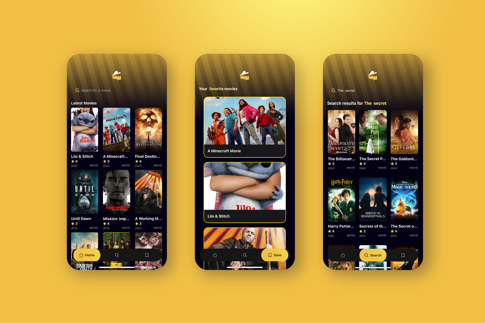
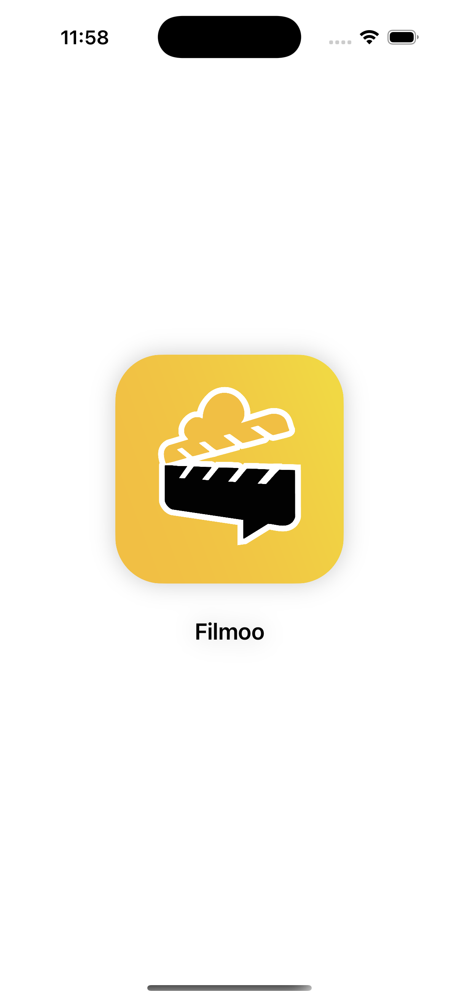
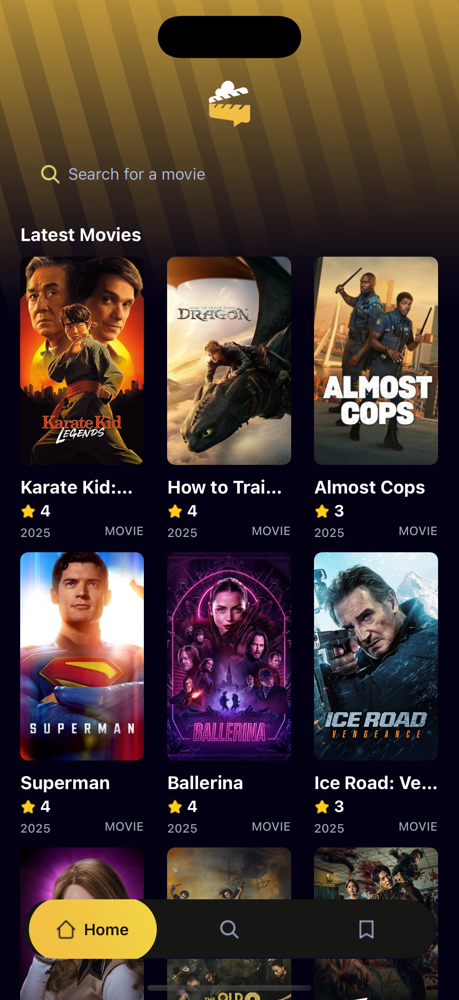
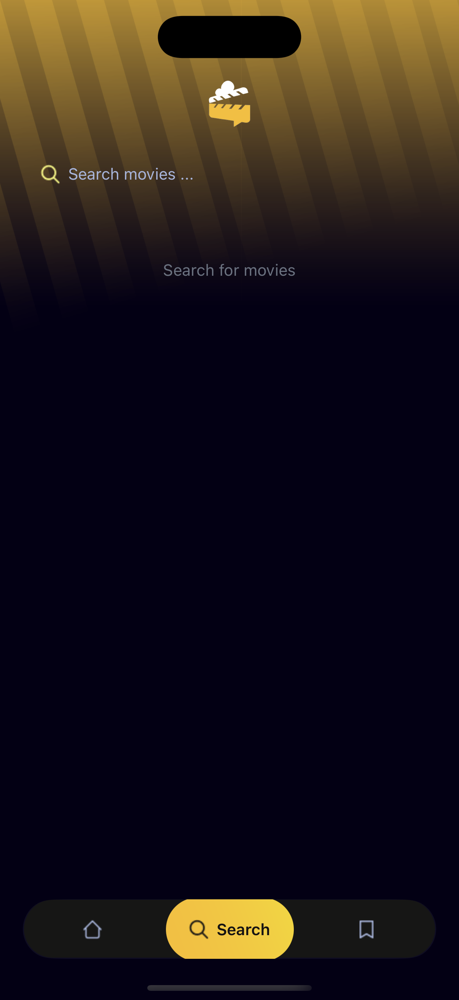
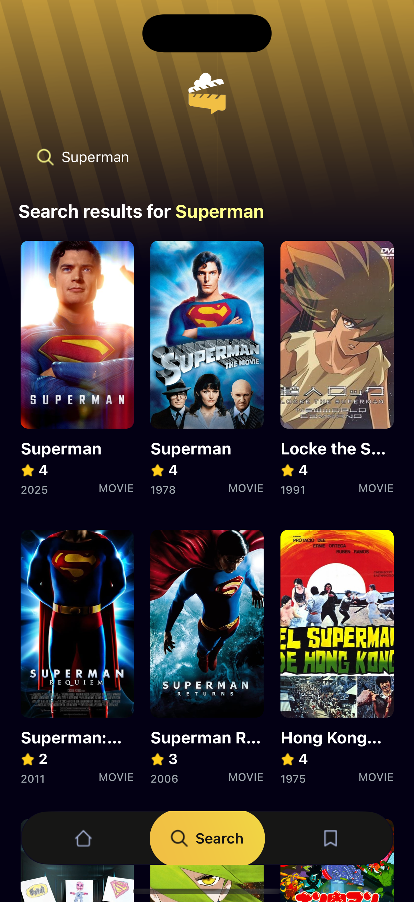
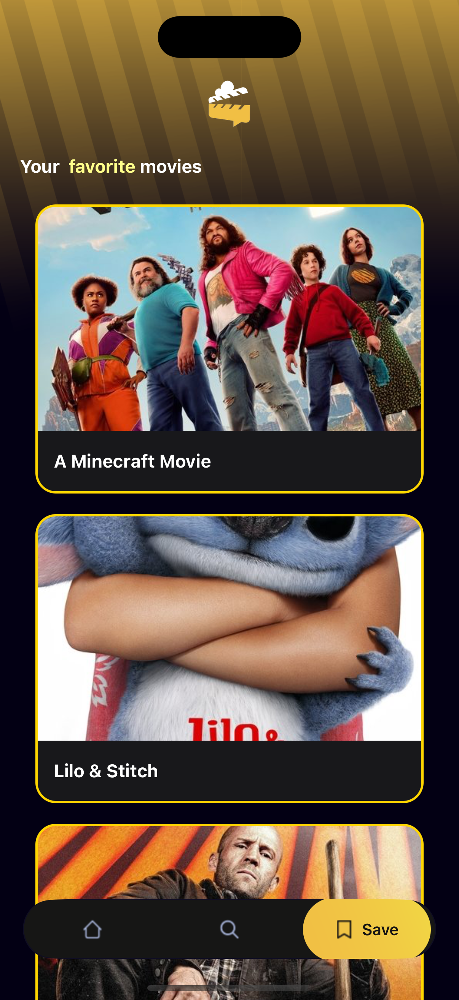
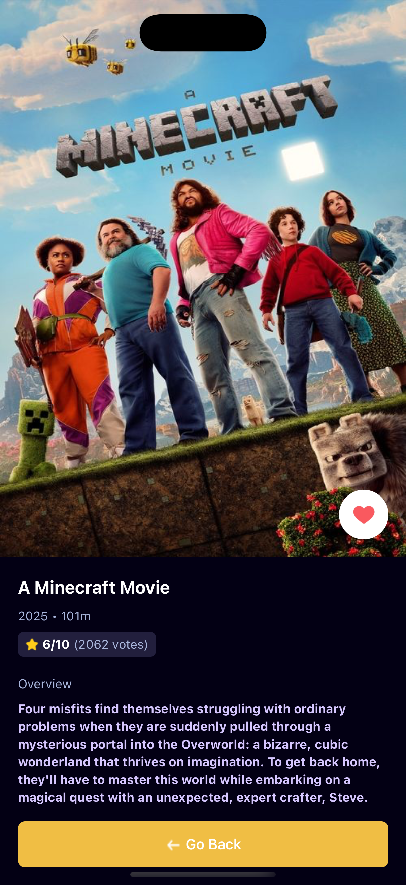

# Filmoo RN

**Filmoo RN** is a movie app built with [React Native](https://reactnative.dev/) and [Expo](https://expo.dev/) that allows users to browse the latest movies, search for them, and save their favorite movies. The app relies on the TMDB API for fetching movie data and uses Appwrite to manage user data and favorite movies.

## Features

- Browse the latest and most popular movies.
- Easily search for movies.
- Save favorite movies to a personal list.
- Modern and user-friendly interface.
- Dark mode support.
- Store user data and favorites using Appwrite.

## Technologies Used

- **React Native** and **Expo** for app development.
- **Tailwind CSS** (via NativeWind) for styling.
- **TMDB API** for fetching movie data.
- **Appwrite** for data and favorites management.
- **TypeScript** to ensure code quality.

## App Screenshots

  
  
  
  
  
  
  

  
## Getting Started

1. Make sure you have Node.js and npm installed.
2. Install dependencies:
3. Create a `.env` file and add your API keys (TMDB and Appwrite).
4. Run the app:

## Project Structure

- `app/` : App screens.
- `components/` : UI components.
- `services/` : Data fetching and Appwrite services.
- `constants/` : Static icons and images.
- `interfaces/` and `types/` : TypeScript definitions.

## Contribution

Contributions are welcome! Feel free to open issues or pull requests for improvements or fixes.

---

This project is developed for educational and experimental purposes.

